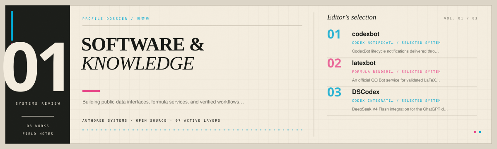
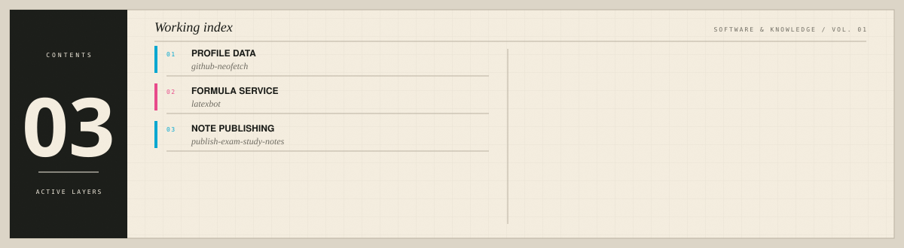

<picture>
  <source media="(prefers-color-scheme: dark)" srcset="assets/hero-dark.svg">
  <source media="(prefers-color-scheme: light)" srcset="assets/hero-light.svg">
  
</picture>

 

Building public-data interfaces, formula services, and verified workflows for publishing study notes\. Open-source contributor to the fish2lab/DSCodex project\.

## Collections / 内容入口

<table>
<tr>
<td width="33%" valign="top"><strong>01 · 知乎 / Zhihu</strong>  在理性、表达与审美之间往返：一个“披着文科生外衣、想当艺术生的理科生”，记录学习、技术与生活观察。  <a href="https://www.zhihu.com/people/ze-meng-zhou-29">前往知乎 →</a></td>
<td width="33%" valign="top"><strong>02 · GitHub</strong>  代码与工具的构建现场：公开数据界面、公式机器人、知识发布流程，以及对 DSCodex 的安全与 Windows 兼容性贡献。  <a href="https://github.com/LeaningLearner">查看代码 →</a></td>
<td width="33%" valign="top"><strong>03 · 博客 / Blog</strong>  工程、控制理论、机器视觉与数学的长期档案：把项目、研究笔记与可复用知识组织成可检索、可回访的系统。  <a href="https://zemengzhou.com/">阅读博客 →</a></td>
</tr>
</table>

## Selected work

| Repository | Role | Purpose |
| --- | --- | --- |
| [`github-neofetch`](https://github.com/LeaningLearner/github-neofetch)  | PROFILE INTERFACE | A terminal-style view of public GitHub profiles, repository stats, and avatars\. |
| [`latexbot`](https://github.com/LeaningLearner/latexbot)  | FORMULA RENDERING | An official QQ Bot service for validated LaTeX and MathJax image replies\. |
| [`publish-exam-study-notes`](https://github.com/LeaningLearner/publish-exam-study-notes)  | KNOWLEDGE WORKFLOW | A Codex skill for faithful, verified, safe publication of Chinese exam notes\. |

## Upstream PRs / 外部贡献

### <a href="https://github.com/fish2lab/DSCodex">fish2lab/DSCodex</a> · Contributor

DSCodex 由 fish2lab 创建；我以 Contributor 身份提交并合并了 Windows 非 ASCII 用户目录兼容修复，以及路由生命周期、凭据与代理处理的安全加固。

| Merged PR | Change | Scope |
| --- | --- | --- |
| <a href="https://github.com/fish2lab/DSCodex/pull/5"><strong>#5</strong></a> 2026-08-03 | security: harden router lifecycle, credentials, and proxy handling | +1,739 · −178 · 17 changed files |
| <a href="https://github.com/fish2lab/DSCodex/pull/1"><strong>#1</strong></a> 2026-08-02 | fix: use %USERPROFILE% in Windows autostart VBS for non-ASCII homes | +35 · −2 · 2 changed files |

## Contributions / 贡献轨迹

<picture>
  <source media="(prefers-color-scheme: dark)" srcset="assets/contributions-dark.svg">
  <source media="(prefers-color-scheme: light)" srcset="assets/contributions-light.svg">
  
</picture>

## Working index

<picture>
  <source media="(prefers-color-scheme: dark)" srcset="assets/closed-loop-dark.svg">
  <source media="(prefers-color-scheme: light)" srcset="assets/closed-loop-light.svg">
  
</picture>

## Project archive

No supporting projects selected.

<a href="https://github.com/LeaningLearner">GitHub</a> · <a href="https://www.zhihu.com/people/ze-meng-zhou-29">知乎</a> · <a href="https://zemengzhou.com/">Blog</a>

<!-- Generated by profile-control-plane. Edit profile.yaml, not this file. -->
