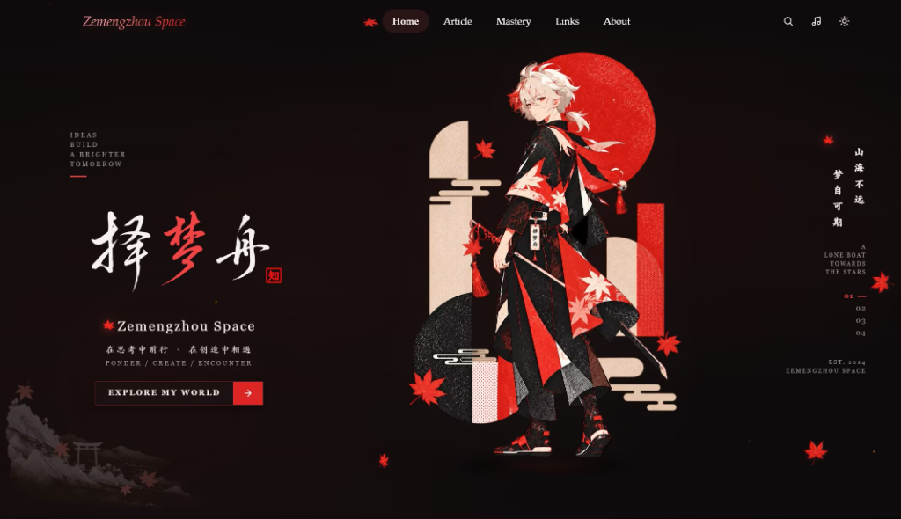

  

Building agentic developer tools, verification workflows, and long-lived engineering knowledge systems.

## Collections

<table>
  <thead>
    <tr>
      <th width="33.3%" align="left">01 &nbsp;·&nbsp; Code &amp; Systems</th>
      <th width="33.3%" align="left">02 &nbsp;·&nbsp; Technical Archive</th>
      <th width="33.3%" align="left">03 &nbsp;·&nbsp; Essays &amp; Notes</th>
    </tr>
  </thead>
  <tbody>
    <tr>
      <td valign="top">
        
<strong>GitHub / Open Source</strong>

        
Agentic developer tooling, Obsidian navigation workflows, chat runtimes, and upstream stability engineering.

        
<a href="https://github.com/dreamfarer-space"><strong>Explore Repositories &rarr;</strong></a>

      </td>
      <td valign="top">
        
<strong>Blog / Zemengzhou Space</strong>

        
Long-form technical archive spanning control theory, computer vision, mathematical methods, and software design.

        
<a href="https://zemengzhou.com/"><strong>Read Articles &rarr;</strong></a>

      </td>
      <td valign="top">
        
<strong>Zhihu / Technical Column</strong>

        
Reflections exploring mathematical foundations, engineering rigor, learning observations, and aesthetics.

        
<a href="https://www.zhihu.com/people/ze-meng-zhou-29"><strong>Visit Column &rarr;</strong></a>

      </td>
    </tr>
  </tbody>
</table>

## Selected Work

### [**milind-soni / OpenMausBot**](https://github.com/milind-soni/OpenMausBot)

 &nbsp;  &nbsp;  &nbsp; 

> **Overview**: An open-source alternative to Grok Bot featuring an isolated virtual machine execution environment for conversational bots.

| Merged Pull Request | Status | Impact &amp; Scope | Date |
| :--- | :---: | :--- | :---: |
| [**#2025** &middot; feat(claude): offer Claude Sonnet 5.5 in the Claude engine](https://github.com/milind-soni/OpenMausBot/pull/2025) |  | Added Claude Sonnet 5.5 to the model catalog with context-window detection and regression coverage | Sep 2026 |
| [**#1959** &middot; fix(chat): align KaTeX version and cover adjacent inline code](https://github.com/milind-soni/OpenMausBot/pull/1959) |  | Deduplicated KaTeX dependencies and added regression coverage for adjacent inline code spans | Sep 2026 |
| [**#1607** &middot; fix(chat): make wrapped bot mentions trigger in channels](https://github.com/milind-soni/OpenMausBot/pull/1607) |  | Fixed regex token boundary parsing for wrapped channel mentions | Sep 2026 |
| [**#1608** &middot; feat(chat): render LaTeX math with KaTeX](https://github.com/milind-soni/OpenMausBot/pull/1608) |  | Integrated KaTeX math rendering engine with regression test suites | Sep 2026 |

---

### [**liguobao / ds-harness-remote**](https://github.com/liguobao/ds-harness-remote)

 &nbsp;  &nbsp;  &nbsp; 

> **Overview**: A multi-device remote access solution for DeepSeek Harness and CodeX across desktop, Android, and Web, with end-to-end encryption and P2P-first connectivity.

| Merged Pull Request | Status | Impact &amp; Scope | Date |
| :--- | :---: | :--- | :---: |
| [**#94** &middot; fix(android): move quick prompts to the composer](https://github.com/liguobao/ds-harness-remote/pull/94) |  | Moved quick prompts to a direct composer entry while preserving prompt management, persistence, localization, drafts, and existing file/terminal/trajectory tools | Oct 2026 |
| [**#91** &middot; feat(android): add new-chat navigation, trajectories, and prompt management](https://github.com/liguobao/ds-harness-remote/pull/91) |  | Added top-level new-chat controls, trajectory access, localized prompt management and persistence, plus guarded Android back-stack behavior | Oct 2026 |
| [**#89** &middot; feat(android): add native mention/command menus, message actions, and trajectory mode](https://github.com/liguobao/ds-harness-remote/pull/89) |  | Added official-style @ and slash menus, message feedback/branching/usage actions, and a Host-backed trajectory inspection mode | Oct 2026 |
| [**#87** &middot; fix: close live HTTP/WebSocket previews when ports are revoked](https://github.com/liguobao/ds-harness-remote/pull/87) |  | Actively terminates revoked preview connections and pending reads/handshakes while preserving allowed ports and safe handle reuse | Sep 2026 |
| [**#86** &middot; fix: isolate loopback previews across client disconnects](https://github.com/liguobao/ds-harness-remote/pull/86) |  | Isolated loopback preview resources per authenticated connection so one client disconnect or reconnect no longer breaks other clients or requires a Host restart | Sep 2026 |
| [**#83** &middot; feat(android): improve the chat composer and conversation actions](https://github.com/liguobao/ds-harness-remote/pull/83) |  | Added workspace and tool-access pickers, improved model and permission controls, and fixed session membership and image-prompt handling | Sep 2026 |
| [**#84** &middot; fix(scripts): handle missing optional plugins during Windows uninstall](https://github.com/liguobao/ds-harness-remote/pull/84) |  | Made Windows uninstall remove only declared plugins so missing File Viewer dependencies no longer interrupt cleanup | Sep 2026 |

---

### [**fish2lab / DSCodex**](https://github.com/fish2lab/DSCodex)

 &nbsp;  &nbsp;  &nbsp; 

> **Overview**: A zero-patch local loopback router bringing DeepSeek models into official ChatGPT desktop and Codex workflows with native Responses API support.

| Merged Pull Request | Status | Impact &amp; Scope | Date |
| :--- | :---: | :--- | :---: |
| [**#19** &middot; fix: Windows router auto-recovery &amp; Codex model paths](https://github.com/fish2lab/DSCodex/pull/19) |  | Stabilized background supervisor recovery and localized model paths | Aug 2026 |
| [**#5** &middot; security: harden router lifecycle, credentials, and proxy handling](https://github.com/fish2lab/DSCodex/pull/5) |  | Hardened token lifecycles, credential storage, and proxy forwarding | Aug 2026 |
| [**#1** &middot; fix: use `%USERPROFILE%` in Windows autostart VBS](https://github.com/fish2lab/DSCodex/pull/1) |  | Resolved Windows autostart failure caused by Unicode home directories | Aug 2026 |

---

## Additional Upstream Contributions

### [**NousResearch / hermes-agent**](https://github.com/NousResearch/hermes-agent)

 &nbsp;  &nbsp; 

| Upstream Pull Request | Contribution | Date |
| :--- | :--- | :---: |
| [**#127983** &middot; Desktop bundle-skew probes no longer pile up git processes or survive quit](https://github.com/NousResearch/hermes-agent/pull/127983) | Incorporated the coalesced and cached bundle-skew checker from my [**#126186**](https://github.com/NousResearch/hermes-agent/pull/126186), preserving authorship. My original PR's Windows process-tree tests passed on Windows Server 2025 (50 passed, 1 skipped). | Sep 2026 |

> **Attribution**: My original PR **#126186** was superseded rather than merged directly. Its code was incorporated into the merged **#127983**, whose description explicitly credits **@dreamfarer-space**. This contribution is listed separately and excluded from the merged-PR count above.

#### Active upstream work

| Pull Request | Status | Scope | Date |
| :--- | :---: | :--- | :---: |
| [**#132052** &middot; fix(desktop): show readable artifact filenames without changing links](https://github.com/NousResearch/hermes-agent/pull/132052) |  | Normalizes readable artifact/media filenames across Chinese, URL-encoded and Windows path cases while preserving original links and save paths | Oct 2026 |
| [**#125227** &middot; fix(install): preserve Unicode bootstrap Python paths on Windows](https://github.com/NousResearch/hermes-agent/pull/125227) |  | Preserves non-ASCII bootstrap Python paths across PowerShell and uv installer flows on supported Windows setups | Sep 2026 |
